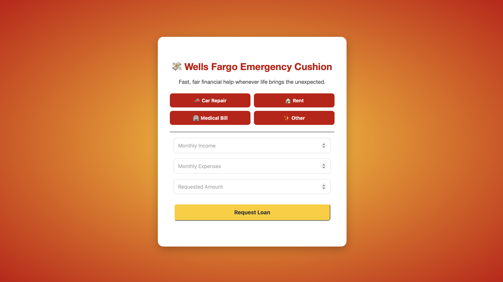
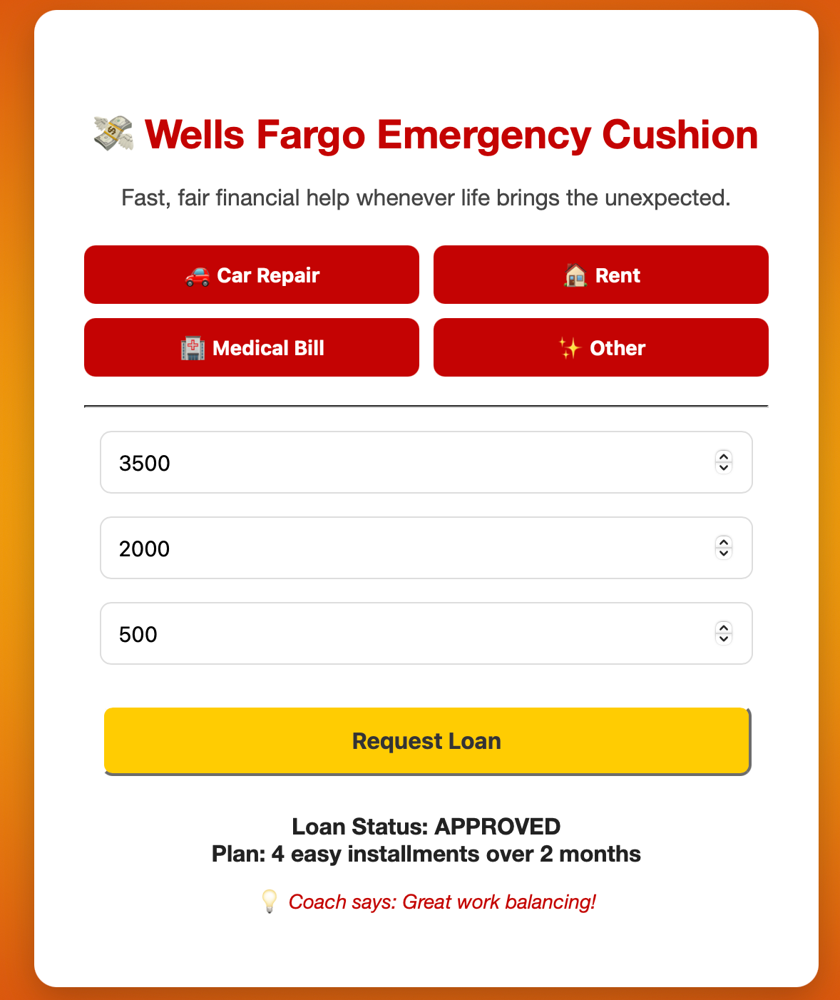

# 💸 Wells Fargo Emergency Cushion

---

## 🚨 The Problem
When life hits with the unexpected — car repairs, rent, medical bills, or paycheck delays — too many people are forced into **predatory payday loans** that create cycles of debt and stress.  

---

## 🌟 Our Solution
**Wells Fargo Emergency Cushion** is a prototype tool that provides:

- ⚡ **Instant loan decisioning** (fair + fast, powered by ML).  
- 📅 **Clear repayment plans** (no confusing terms, no hidden fees).  
- 💡 **Confidence Coach tips** that empower, not shame, customers.  
- 🎨 **Wells Fargo–themed UI** for trust + brand familiarity.  

We transform a stressful financial moment into a moment of **support + empowerment**.  

---

## 🖥️ Demo
- ✅ Loan Approved → shows repayment plan + confidence tip.  
- ❌ Loan Denied → supportive coaching advice, not just rejection.  

---

## ⚙️ How to Run Locally

### 1. Clone this repo and create a virtual environment  
Run:  
`git clone https://github.com/Pranjal-ganvir12/Emergency_Cushion_GCAxWF.git`  
`cd Emergency_Cushion_GCAxWF`  
`python3 -m venv venv`  

### 2. Activate the virtual environment  
On Mac/Linux: `source venv/bin/activate`  
On Windows (PowerShell): `venv\Scripts\Activate.ps1`  

### 3. Install dependencies  
Run: `pip install -r requirements.txt`  

### 4. Train the ML model  
Run: `python3 backend/train_models.py`  

### 5. Run the Flask app  
Run: `python3 backend/app.py`  

### 6. Open in browser  
Go to: [http://127.0.0.1:5000](http://127.0.0.1:5000)  

---

## 📦 Requirements
- flask  
- flask-cors  
- scikit-learn  
- pandas  
- numpy  
- joblib  
- nginx  

---

## 📌 Future Improvements
- Integration with real Wells Fargo data systems  
- More diverse + robust training datasets  
- Personalized repayment plans using customer history  
- Mobile-first responsive design  

---

## 📝 License
MIT © 2025